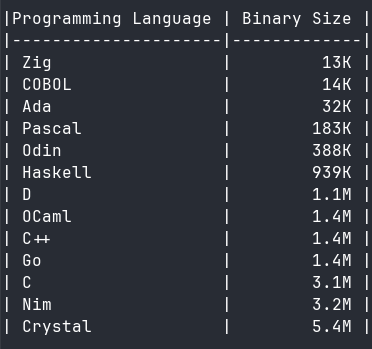

# Statically Linked "Hello, World!" Binary Size Comparison

This project collects simple **Hello, World!** programs in C, C++, Go, Ada, Pascal, D, Nim, Zig, Crystal, Haskell. All built as **fully static** (self-contained) executables with no dynamic library dependencies.

Goal: Compare the resulting binary file sizes for portable, single-file binaries.

All examples print `Hello, world!` and exit cleanly.

## Build Commands

```bash
C:       clang -static -o hello_c hello.c
C++:     clang++ -static -o hello_cpp hello.cpp -lstdc++
Go:      CGO_ENABLED=0 go build -ldflags="-s -w" -o hello_go hello.go
Ada:     gnatmake -static hello.adb -o hello_ada
Pascal:  fpc -Xs hello.pas -ohello_pascal
D:       dmd -L-static hello.d -ofhello_d
Nim:     nim compile --passC:-static --passL:-static hello.nim -o hello_nim
Zig:     zig build-exe -static hello.zig -O ReleaseSmall
Crystal: crystal build --static hello.cr -o hello_crystal --release
Haskell: ghc -static hello.hs -o hello_hs -O2 -optl=-s
```

### Binary size comparison chart
